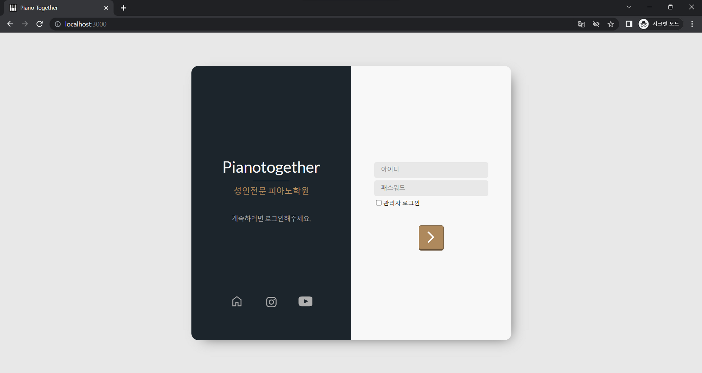
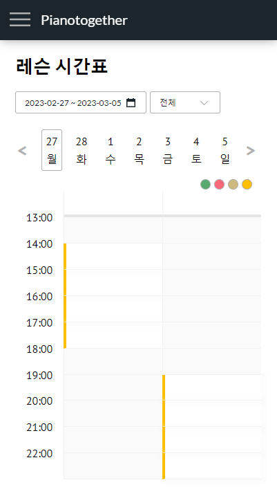
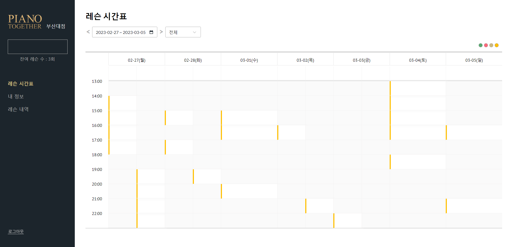

# 전반적인 소개
본 프로그램은 '학원 수강생/레슨 관리'를 주요 기능으로 갖는 소프트웨어(이하 '소프트웨어') 입니다. 
초기 개발 버전은 피아노학원에 맞춰 디자인되었지만 피아노학원 외에도 1대1 강좌를 관리해야 하는 학원에서
용이하게 사용될 수 있습니다.

프론트는 React, 백엔드는 Node.js로 설계되었으며 중~소규모의 학원에 적합한 프로그램입니다.
대규모 학원의 경우 추가적인 로드밸런싱 작업이나 db 분리 작업 이후 사용이 가능합니다.

## 주요 기능들

> - 수강생 관리 기능
> - 강사 관리 기능
> - 레슨 관리 기능

## 메인 화면

소프트웨어의 로그인 화면입니다. 이 화면에서 관리자로 로그인 시 관리자 페이지로 이동, 사용자로 로그인 시 
사용자 페이지로 이동합니다.

아래 캡처본은 이용자 로그인 시 보이는 화면입니다.

메인 화면은 가장 많이 조회/사용되는 기능인 레슨 시간표를 표시합니다.

### 다음 게시글: [2. 수강생 관리 기능](../user_management/USER_MANAGEMENT.md)