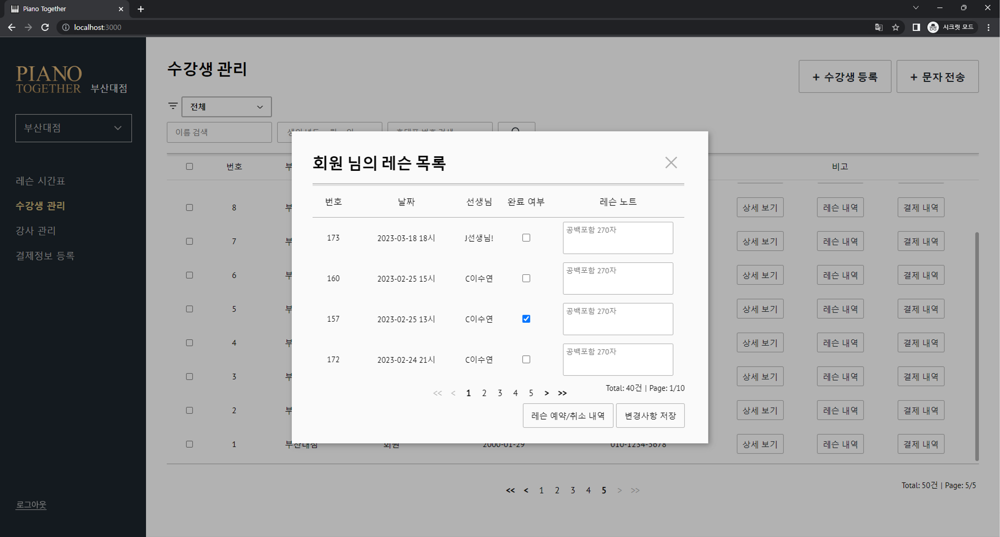

# 레슨 관리 기능
레슨 관리 기능입니다.

## 4-1. 레슨 등록/취소 

레슨은 관리자가 특정 수강생의 레슨을 등록할 수도 있고, 수강생이 자신의 사용 가능한 레슨 횟수를 소비하여 직접 등록이 가능합니다.
단, 이 두 가지의 경우 모두 레슨 횟수가 1회 차감됩니다.

시간표 페이지에서 레슨 가능한 시간대의 칸에는 '+' 표시가 있으며, 해당 표시를 클릭하면 그 시간대에
레슨을 예약하실 수 있습니다.

레슨을 등록하려는 기간은 좌측 상단의 달력으로 변경이 가능하고, 특정 선생님의 시간표만 보려면 달력 우측의 메뉴를
이용하여 원하는 선생님을 선택하면 됩니다.

레슨 취소 또한 마찬가지로 관리자/수강생 모두 가능합니다. 
정상적인 레슨 취소는 레슨 일자로부터 1일 전 까지만 가능하고, 취소 시 소모된 레슨 횟수가 반환됩니다.

만일 **레슨 당일에 수강생이 레슨을 취소하는 경우** 레슨 횟수는 반환되지 않고 해당 레슨은 완료 처리됩니다.
관리자가 당일에 취소하는 경우에는 레슨 횟수가 반환됩니다.

예약된 레슨이 정상적으로 진행되었다면 시간표에서 해당 레슨을 클릭한 후 '레슨 완료'버튼을 누르면 레슨이 완료 처리됩니다.
완료 처리된 레슨은 '강사 관리' 탭의 재등록률과 레슨 완료율에 반영됩니다.

완료된 레슨에 대해서는 레슨 진도와 수강생의 연습 과정을 기록할 수 있는 '레슨 노트'라는 기능을 제공합니다.

등록되지 않은 수강생(외부 체험레슨 등)의 레슨을 등록하려는 경우 외부레슨 여부에 체크한 후 해당 수강생의 이름과
전화번호를 작성한 후 '레슨 예약하기'버튼을 누르면 정상적으로 등록됩니다.

## 4-2. 레슨노트 작성

수강생의 진도와 성취도를 기록하기 위해 '레슨 노트'라는 기능을 이용하실 수 있습니다.
해당 기능은 '수강생 관리' 탭에서 '레슨 내역'버튼을 클릭하셔서 기록하려는 레슨에 레슨 노트를 작성하실 수도 있습니다.
또는 레슨 시간표(메인 화면)에서 완료된 레슨을 클릭한 후, '레슨 목록' 버튼을 클릭하여 작성하실 수 있습니다.

## 4-3. 레슨 불가능 시간대 지정

선생님의 사정이 생겨 특정 날짜에 레슨을 진행하지 못하게 된 경우 '레슨 불가능 시간대' 지정이 가능합니다.
밝은 부분은 레슨이 가능한 시간대, 어두운 부분은 시간표 상 레슨이 불가능한 시간대, 빨간색으로 지정된 부분은
'기타 사정으로 레슨이 불가능한 시간대'를 의미합니다. 
