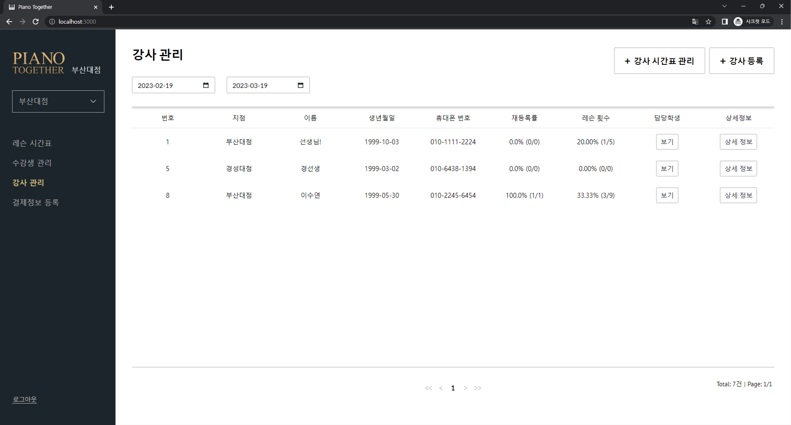
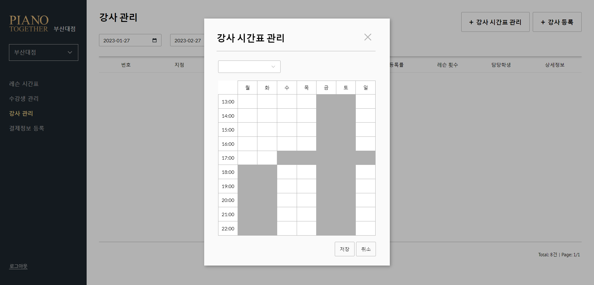

## 강사 관리 기능

수강생 관리 기능과 마찬가지로, 관리자 계정(강사 계정)으로 로그인 후 '강사 관리 기능' 탭으로 액세스 가능합니다.

### 3-1. 강사 등록/정보 관리

우측 상단의 '강사 등록'버튼을 누르면 강사 등록이 가능합니다. 생성된 강사 계정은 '관리자'권한을 가지며,
관리자 기능을 사용할 수 있습니다. 수강생 등록/정보 확인과 사용법이 동일합니다.

'담당 학생' 버튼을 클릭 시 해당 강사가 담당한 수강생들의 목록을 불러와 출력합니다. 

만약 강사가 특정 수강생과 레슨을 1회 이상 진행했고, 그 수강생의 가장 최근 레슨을 담당했다면
해당 수강생은 담당 학생 리스트에 나타납니다.

### 3-2. 강사 시간표 관리

'강사 시간표 관리'버튼 클릭 시 해당 창을 표시하며 강사의 시간표를 수정할 수 있습니다. 
특정 시간과 요일의 레슨 가능/불가능 여부는 해당 칸을 클릭하여 설정하실 수 있습니다. 
밝은 부분은 '레슨 가능한 시간', 어두운(회색) 부분은 '레슨 불가능한 시간'에 해당합니다. 

맨 윗줄의 요일을 선택하여 선택한 요일의 모든 시간대를 지정/지정 해제하거나,
좌측의 시간을 선택하여 모든 요일의 해당 시간을 지정/지정 해제할 수 있습니다.

퇴사한 강사의 시간표는 자동으로 삭제됩니다.

#### 다음 게시글: [4. 레슨 관리 기능](../lesson_management/LESSON_MANAGEMENT.md)