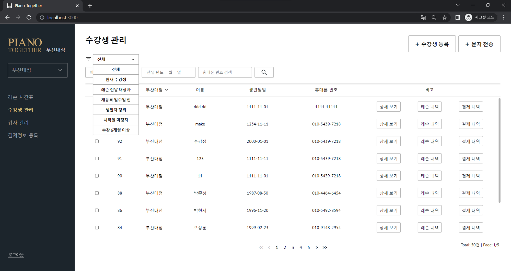
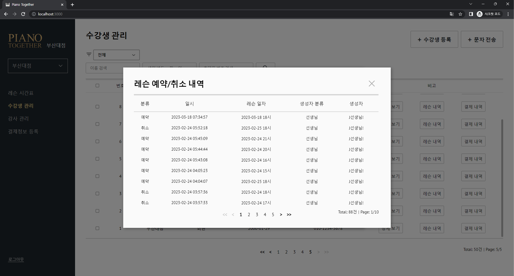
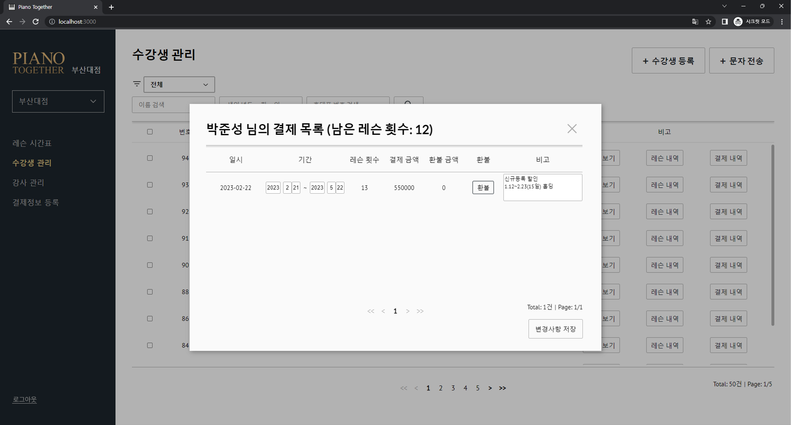
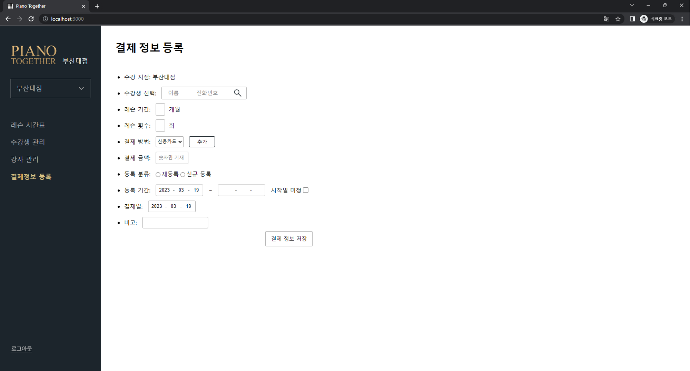
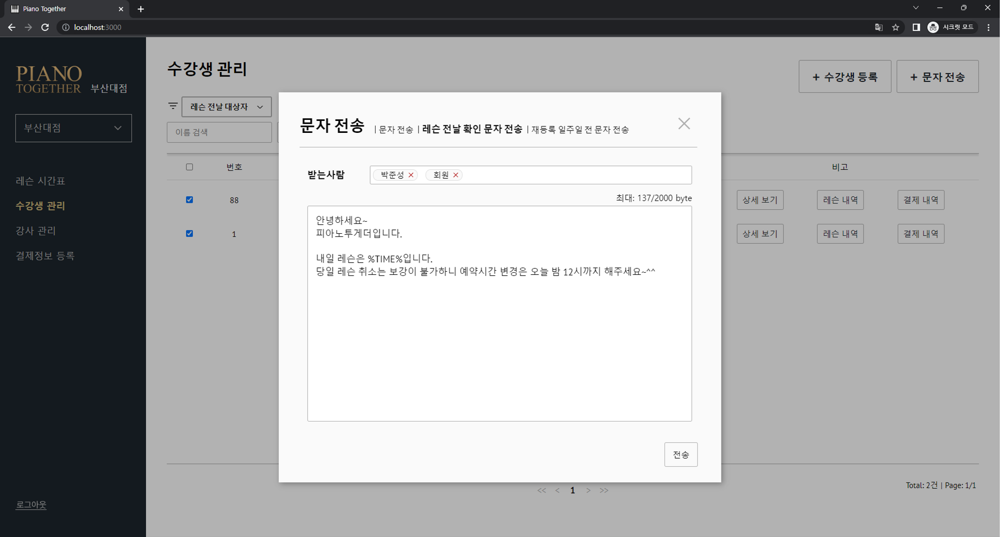

# 수강생 관리 기능

수강생 관리 기능은 관리자 계정으로 로그인한 후 좌측의 '수강생 관리'탭을 눌러 사용 가능합니다.
위 캡처본은 실제 수강생의 데이터가 아닌 가짜 데이터로 만든 예시 사진입니다.

## 2-1. 수강생 등록/정보 관리

수강생 등록은 오른쪽 위의 '+ 수강생 등록' 버튼을 클릭한 후 필요한 정보를 모두 입력한 후, 
'등록'버튼을 누르면 새로운 수강생 등록이 가능합니다.

수강생이 등록되면 해당 수강생은 '결제정보 등록'탭에서 **결제정보를 입력하여야만 로그인과 레슨 예약이 가능합니다.**
해당 기능은 [2-2. 결제 등록](#2-2-결제-등록)에서 자세히 설명하도록 하겠습니다.

수강생 표 위의 검색창을 이용하여 조건에 맞는 수강생 검색이 가능합니다. 수강생 정보 조회/수정, 탈퇴 처리는 비고란의
'상세보기' 버튼을 클릭하시면 사용하실 수 있습니다.

'레슨 내역'버튼과 '결제 내역'버튼은 각각 수강생이 진행한 레슨과 결제의 내역을 출력하는 버튼입니다.

## 2-2. 결제 등록

수강생의 결제 정보 등록 페이지입니다. '수강생 선택' 항목의 검색창을 이용하여 조건에 맞는 수강생을 선택한 후
해당 수강생의 결제 조건에 따라 값을 입력한 후 결제정보를 저장할 수 있습니다.

결제정보가 등록되면 해당 수강생은 '등록 기간'에 지정된 기간동안 시스템 로그인/레슨 예약이 가능합니다.
'시작일 미정'은 일단 결제를 했지만 아직 시작 날짜를 정하지 못한 수강생을 등록할 때 사용됩니다.

'레슨 횟수'는 수강생이 레슨을 예약할 수 있는 잔여 횟수를 의미합니다. 결제정보 등록 시 '레슨 횟수'로 지정된 숫자만큼
수강생이 예약 가능한 레슨 횟수가 늘어나며, 이전 결제 기간 중 사용하지 않은 잔여 레슨 수는 이월됩니다.
> (e.g. 이전 결제기간(8월 1일~9월 1일)의 레슨 횟수가 총 4회였는데, 3회만 사용하여 1회가 남아있고 
9월 1일에 레슨 4회분을 결제할 경우 결제 후 해당 수강생의 잔여 레슨 수는 5회)

**만일 이월을 원치 않으신다면 수강생 관리 페이지에서 해당 수강생의 잔여 레슨 수를 0회로 설정한 후 
결제정보를 등록하시면 됩니다.**

## 2-3. 문자 전송

문자 전송 기능입니다. 수강생 리스트에서 체크박스로 수강생을 선택한 후 메시지 전송이 가능합니다.

일반 문자를 전송할 수도 있고, 레슨 전날 확인 문자나 재등록 일주일 전 문자 전송도 가능합니다(양식은 수정 가능).

문자 전송 기능은 cafe24의 LMS전송 서비스를 이용하여 구현하였습니다. 

#### 다음 게시글: [3. 강사 관리 기능](../teacher_management/TEACHER_MANAGEMENT.md)